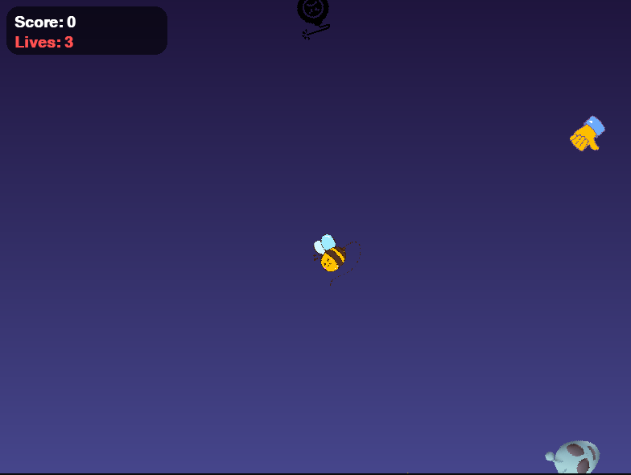

# Emoji Slice - Top-to-Bottom Edition

**Emoji Slice** is a fast-paced top-to-bottom slicing game built with [Pygame](https://www.pygame.org/).  
Slice the negative emojis to score points, but avoid slicing positive emojis to prevent losing lives!

---

## Screenshot / Preview


---

## Features
- Fun and colorful emoji slicing gameplay
- Dynamic score, lives, and combo system
- Floating text effects for combos and points
- Trail effect showing slicing path
- Pause and Game Over screens
- Smooth animations with top-to-bottom emoji movement

---

## Installation
 1. Clone the repository:
  ```bash
  git clone https://github.com/Amrutanshu-07/Emoji-Slicing-Game.git
  cd Emoji-Slicing-Game

 2. Install dependencies:
  pip install pygame

 3. Run the game:
  python emoji_slice.py
  
## Controls

 1. Mouse Left Click → Slice emojis

 2. ESC → Pause / Resume the game

# Scoring & Mechanics

 1. Slice a negative emoji → +1 point

 2. Achieve combos (3, 5 slices) → Bonus points and messages

 3. Slice a positive emoji → -1 point and lose a life

 4. Game ends when all lives are lost

# Make sure you have **Python 3.8+** installed.
